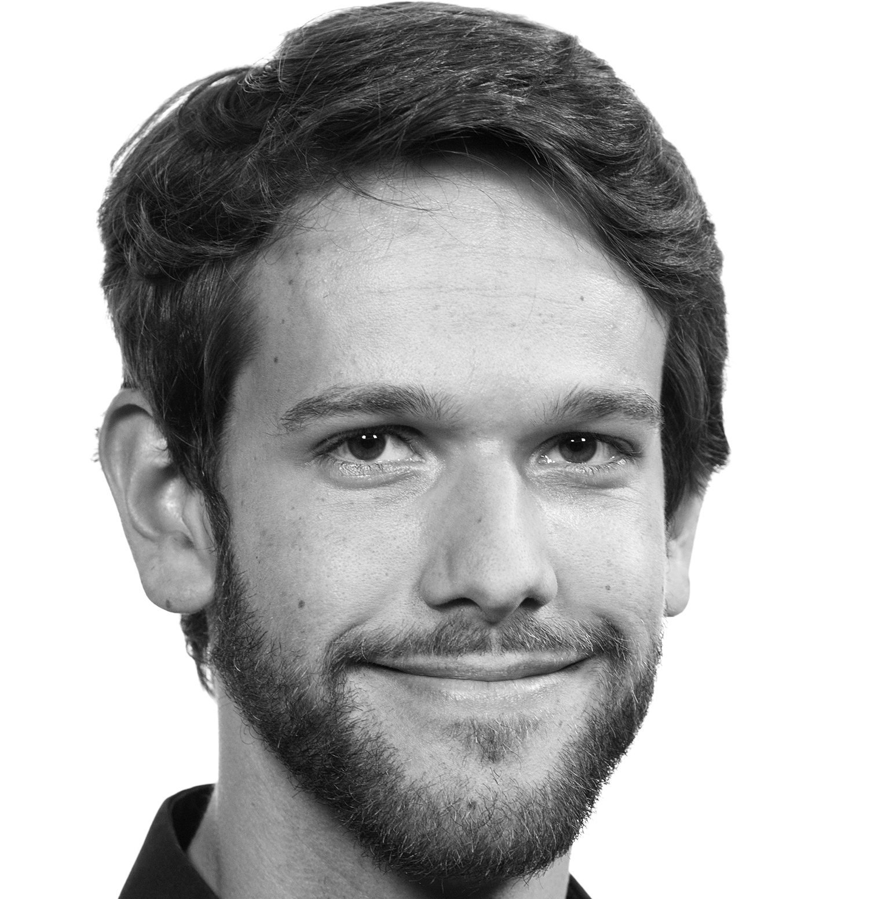

## About Me

Hi! I am a Software Engineer and Computer Science Researcher. Currently, I am working as a postdoctoral researcher at the [University Hospital](https://helse-bergen.no/) in Bergen where I am working with [Digitization](https://geek-and-poke.com/geekandpoke/2016/12/12/hype-cycle) in [Pathology](https://en.wikipedia.org/wiki/Pathology). Concretely, we  are applying techniques such as [Process Mining](http://www.processmining.org/), [Optimization](https://en.wikipedia.org/wiki/Mathematical_optimization), and ML/AI to gain insights about Pathology workflows and in the long run reduce response times via intelligent utilization of resources and scheduling of activities.

Previously, I had been conducting research on _Software Interoperability_ and _Consistency Management_ while being employed as a PhD research fellow at the [Western Norway University of Applied Sciences (HVL)](https://www.hvl.no/) where I successfully defended my PhD on the _9th of February 2022_. My thesis openly accessible [here](https://hvlopen.brage.unit.no/hvlopen-xmlui/handle/11250/2837740).

Before coming to Norway, I have had positions as a software engineer at different companies in Germany.

## Research Interests

My research interests span various domains of Computer Science and Software Engineering.
One of my main goals is to turn theoretical research results into practically relevant tools and methods in order to improve the quality of software products.
My focus lies on the following areas:

- Interoperability and Software System Integration
- Model-Driven Software Engineering and Automation
- Process Modeling and Optimization
- Data Management: ETL-Pipelines, Privacy, Anonymization, Governannce 
- Theoretical Foundations of Software Modeling: Universal Algebra and Category Theory

## Selected Publications
1. P. Stünkel, A framework for multi-model consistency management, Ph.D. Dissertation (2022), Høgskulen på Vestlandet, [[open access]](https://hvlopen.brage.unit.no/hvlopen-xmlui/handle/11250/2837740) 
1. P. Stünkel, H. König, A. Rutle, Y. Lamo: Comprehensive Systems: A formal foundation for Multi-Model Consistency Management, Formal Aspects of Computing (2021) [[open access]](https://link.springer.com/article/10.1007/s00165-021-00555-2)
2. P. Stünkel, H. König: Single pushout rewriting in comprehensive systems of graph-like structures. Theor. Comput. Sci. 884: 23-43 (2021) [[open access]](https://www.sciencedirect.com/science/article/pii/S0304397521004059?via%3Dihub)
3. P. Stünkel, O. von Bargen, A. Rutle, Y. Lamo: GraphQL Federation: A Model-Based Approach. J. Object Technol. 19(2): 18:1-21 (2020) [[open access]](http://www.jot.fm/contents/issue_2020_02/article18.html)

For more publications, have a look at my [DBLP index](https://dblp.org/pid/222/4847.html)!

## Current Projects

- **CorrLang** A tool that facilitates system integration and/or heterogenous model management, based on a DSL for specifying semantic relationships among data models. [[github]](https://github.com/webminz/corr-lang) [[homepage]](https://www.corrlang.io)
- **DELTA** A tool for database refactoring. [[publication]](https://www.researchgate.net/publication/320986991_DELTA_-_A_tool_for_database_refactoring)

## Get in touch

If you are interested in one ore more of the aforementioned topics, pleas do not hesitate to [contact](/contact) me!